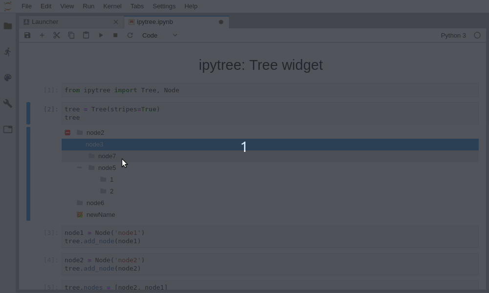

ipytree
=======

A Tree Widget using Jupyter-widgets protocol and [jsTree](https://www.jstree.com/)

Installation
------------

For a development installation (requires npm),

    $ git clone https://github.com/QuantStack/ipytree.git
    $ cd ipytree
    $ pip install -e .
    $ jupyter nbextension install --py --symlink --sys-prefix ipytree
    $ jupyter nbextension enable --py --sys-prefix ipytree

You would also need to run those commands from the root dir of the repo in order to make it work with JupyterLab:

    $ jupyter labextension install @jupyter-widgets/jupyterlab-manager
    $ jupyter labextension install js
